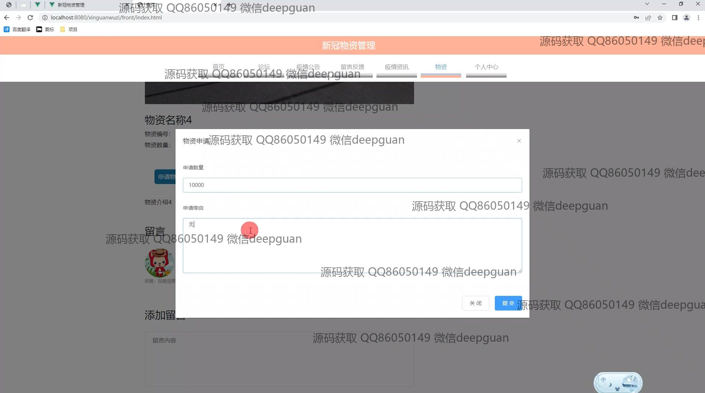

<h1 align="center">新冠物资管理</h1>

## 简介
新冠物资管理系统：角色分为管理员、用户；包含物资申请、捐赠管理、库存管理、员工管理及留言反馈等功能，提供全面的新冠物资管理解决方案，提升物资分配效率和信息交流。    --计算机毕业设计源码；毕设源码；java毕业设计源码

## 联系方式

<h3 align="center">获取完整代码与数据库文件 + 微信：deepguan QQ: 86050149 QQ群: 783742310</h3>

<h3 align="center">可帮忙远程部署 包运行成功！提供远程部署、修改代码、设计文档指导、代码讲解等服务！</h3>

## 功能介绍（完整见运行截图）
管理员：系统提供了管理员信息管理功能，可以查询、添加和删除员工信息。管理员能够登录、注册、管理轮播图，更新系统视觉内容，为用户推送物资的申请或捐赠信息。包括公告管理、论坛管理、库存公告及疫情资讯管理，以确保信息的有效交流和更新。通过物资管理页面，管理员可以管理物资的进出库状态，并审核物资捐赠申请，确保物资的合理分配。

用户：用户能通过注册、登录访问系统，进入个人中心查看和修改个人信息，如账号、手机号和邮箱等。用户可以通过系统中的物资管理功能，查看物资详情，进行物资的申请及捐赠操作，并可以通过留言反馈模块与管理员进行沟通交流。此外，用户还可以参与论坛交流，发布帖子分享信息，或者留下个人反馈意见以改进系统服务。

访客：访客有权浏览新冠物资管理系统的注册页面，初步了解系统的功能模块，如首页、论坛、疫情公告、留言反馈和个人中心等。虽然访客无法进行物资申请或捐赠，但能够通过首页了解系统的整体布局和部分内容，通过地图背景页面了解注册流程，并在注册后参与到各种物资管理和捐赠活动中。

## 运行截图

本代码来源于网络,仅供学习参考使用!

